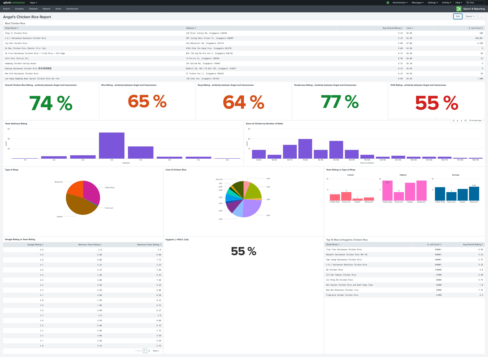

# Singapore Chicken Rice Review

I recently came across an intriguing [youtube](https://www.youtube.com/watch?v=toFZJ9ICWWY&t=2s) video by Angel Hsu that caught my attention. In the video, she undertakes a commendable effort to conduct the most comprehensive review of chicken rice. Angel invested over $5000 and dedicated two months of her time to collect a vast array of data. I highly recommend watching the video, as it is both entertaining and worthwhile.

Angel has made her work available to the public, and you can access it [here](https://tinyurl.com/angelchickenrice).

Being a fan of chicken rice myself, I decided to delve into her data and extract additional insights from it. To facilitate this process, I set up a Splunk instance. You can easily do the same by utilizing the Splunk docker image. Once you have the instance up and running, you can import the Excel file in CSV format. Although the fields (columns) may have inconsistent naming structures and the data might be messy, there's no need to worry. Splunk, with its powerful SPL language, allows you to perform magical transformations and analyses.

 

## Interesting insight:

1. The assessment of Angel and her cameraman regarding chicken rice differs in various aspects such as rice, soup, tenderness, and chili. Overall, the chicken rice ratings show a 74% similarity with a 0.5 variation.
2. The most significant variation in ratings lies in their assessment of the chili. This can be attributed to the subjective nature of individual preferences for spiciness and levels of tolerance.
3. The majority of stalls serve portions of chicken rice ranging from 60 to 100 grams. To put it into perspective, 70 grams is roughly equivalent to two small chicken breasts or four slices of bread.
4. Chicken rice is generally priced below $4, whereas a single ala carte Cheeseburger from McDonald's in Singapore costs $3.90 before taxes.
5. As per the Singapore Food Agency's food safety criteria, the permissible limit for E. coli in food is less than 100 per gram. However, 45% of the tested chicken rice samples exceeded this limit. This indicates that when dining out, around 50% of the food consumed may be unhealthy and unhygienic.
6. There is a significant disparity between the ratings given by Google users and those provided by Angel and her team. Some establishments with high ratings on Google received poor ratings from Angel's team. It is important not to blindly trust either side. The comparison between Angel's ratings and her cameraman's was conducted to assess consistency in their reviews.
7. Angel's recommendations, namely 2 Kampung Chicken Rice and 2 Hainanese Chicken Rice, are among the top 10 establishments in the chart. These options are considered safe choices for consumption. The following is a list of recommendations provided by Angel, presented in no particular order:

    - "Ah Five Hainanese Chicken Rice / Fried Rice / Porridge", 
    - "Kampong Chicken Eating House	"
    - "Ah Boy Chicken Rice (Mentor Eric Teo)"
    - "Wee Kim Hainanese Chicken Rice"

